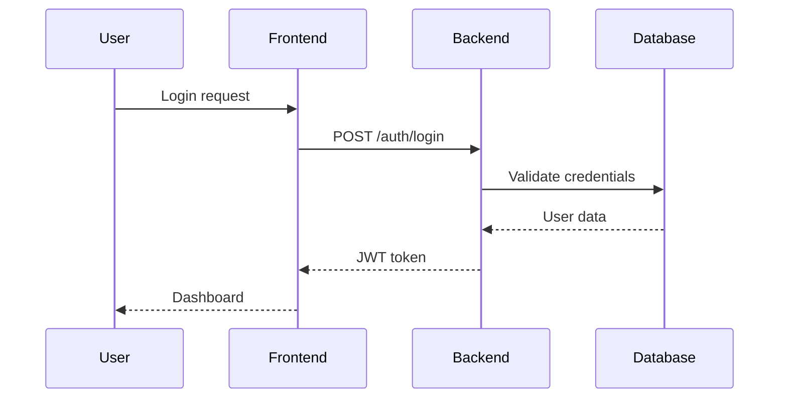

# 📚 ZENITH DOCUMENTATION STANDARDS

**Version:** 1.0  
**Effective Date:** 2026-01-29  
**Based On:** Microsoft Style Guide, Google Developer Docs, Divio/Diátaxis Framework  
**Review Cycle:** Quarterly

---

## 🎯 PURPOSE

This document defines the **official documentation standards** for the Zenith Forensic Audit Platform. All team members must follow these guidelines when creating, updating, or maintaining documentation.

### Why Documentation Standards Matter

✅ **Consistency** - Readers know what to expect  
✅ **Maintainability** - Easier to update and scale  
✅ **Onboarding** - New developers get up to speed faster  
✅ **Professionalism** - Reflects product quality  
✅ **Collaboration** - Reduces ambiguity and confusion

---

## 📖 DOCUMENTATION FRAMEWORK

We follow the **Diátaxis Framework** (formerly Divio Documentation System), which organizes documentation into 4 distinct types:

```
┌─────────────────────────────────────────────────────┐
│                 DIÁTAXIS FRAMEWORK                  │
├─────────────────────────────────────────────────────┤
│                                                     │
│   Learning-Oriented    │    Goal-Oriented          │
│   ─────────────────────┼─────────────────────      │
│   📘 TUTORIALS         │    📗 HOW-TO GUIDES       │
│   "Take me by hand"    │    "Show me how to..."    │
│                        │                           │
│   ─────────────────────┼─────────────────────      │
│   Understanding        │    Information            │
│   ─────────────────────┼─────────────────────      │
│   📙 EXPLANATIONS      │    📕 REFERENCE           │
│   "Help me understand" │    "Tell me the facts"    │
│                                                     │
└─────────────────────────────────────────────────────┘
```

### 1. 📘 TUTORIALS (Learning-Oriented)

**Purpose:** Help beginners achieve their first success  
**Audience:** New users, onboarding developers  
**Tone:** Friendly, encouraging, step-by-step

**Required Elements:**

- [ ] Clear learning objective stated upfront
- [ ] Prerequisites listed (what reader needs before starting)
- [ ] Sequential, numbered steps
- [ ] Expected outcome/result shown
- [ ] Estimated completion time
- [ ] "What you'll learn" section
- [ ] "Next steps" at the end

**Example Structure:**

```markdown
# Tutorial: Creating Your First Audit Project

**Time:** 10 minutes  
**Difficulty:** Beginner  
**Prerequisites:** Access to Zenith Platform, valid login

## What You'll Learn
- How to create a new project
- How to configure basic settings
- How to invite team members

## Step 1: Log In
Navigate to https://zenith.app and...

## Step 2: Access Project Gate
Click the "New Operation" button in the...

## Expected Result
You should now see your project dashboard with...

## Next Steps
- Tutorial: Upload your first transaction data
- How-to: Configure custom risk thresholds
```

**Writing Tips:**

- ✅ Use second person ("You will...")
- ✅ Show actual UI screenshots
- ✅ Provide sample data/files
- ✅ Anticipate and address common errors
- ❌ Don't explain every concept (link to Explanations instead)
- ❌ Don't skip steps assuming knowledge

---

### 2. 📗 HOW-TO GUIDES (Goal-Oriented)

**Purpose:** Solve specific problems for experienced users  
**Audience:** Users who know what they want to do  
**Tone:** Direct, practical, concise

**Required Elements:**

- [ ] Problem statement ("How to do X")
- [ ] Assumptions about user's knowledge
- [ ] Step-by-step instructions
- [ ] Code snippets (if applicable)
- [ ] Warnings/Cautions for critical steps
- [ ] Related guides linked

**Example Structure:**

```markdown
# How to Integrate AI Explainer Modal into a Transaction Table

**Assumes:** You have a React component displaying transactions

## Problem
You want to add AI-powered forensic explanations for individual transactions.

## Solution

### Step 1: Import the Modal Component
```typescript
import AIExplainerModal from '@/app/components/AIExplainerModal';
```

### Step 2: Add State Management

```typescript
const [selectedTxId, setSelectedTxId] = useState<string | null>(null);
```

### Step 3: Add Button to Table Row

⚠️ **Caution:** Ensure transaction.id exists before passing

### Step 4: Add Modal at Component Level

...

## Related Guides

- How to customize modal appearance
- How to batch-explain multiple transactions

```

**Writing Tips:**
- ✅ Focus on the goal, not the journey
- ✅ Provide code you can copy-paste
- ✅ Assume reasonable technical knowledge
- ✅ Link to Reference docs for parameters
- ❌ Don't explain basic concepts
- ❌ Don't make it a tutorial

---

### 3. 📙 EXPLANATIONS (Understanding-Oriented)

**Purpose:** Clarify concepts, design decisions, architecture  
**Audience:** Developers wanting deeper knowledge  
**Tone:** Informative, thoughtful, contextual

**Required Elements:**
- [ ] Topic/concept clearly stated
- [ ] Context (why this exists)
- [ ] How it works (architecture/flow)
- [ ] Design decisions explained
- [ ] Trade-offs discussed
- [ ] Diagrams/visualizations
- [ ] Links to related concepts

**Example Structure:**
```markdown
# Understanding Project-Based Authorization Architecture

## Context
Zenith supports multi-project workspaces where different users have different access levels to each project.

## The Problem We're Solving
Without proper authorization, User A could access User B's sensitive audit data...

## How It Works

### Architecture Overview
[Diagram showing UserProjectAccess table, middleware, endpoints]

### Role Hierarchy
We implement three roles:
1. **Viewer** - Read-only access to project data
2. **Analyst** - Can create cases, run analyses
3. **Admin** - Full control, can manage users

### Design Decisions

**Why role-based instead of permission-based?**
We chose RBAC over fine-grained permissions because...

**Trade-offs:**
- ✅ Simpler mental model for admins
- ✅ Easier to audit who has access
- ❌ Less flexibility for custom permissions
- ❌ Power users are "Analysts" even if they only need one extra permission

## Related Concepts
- See: Understanding Authentication vs Authorization
- See: Database Schema - UserProjectAccess table
```

**Writing Tips:**

- ✅ Use diagrams and flowcharts
- ✅ Explain the "why" behind decisions
- ✅ Discuss alternatives considered
- ✅ Connect to broader concepts
- ❌ Don't give step-by-step instructions
- ❌ Don't list API parameters

---

### 4. 📕 REFERENCE (Information-Oriented)

**Purpose:** Provide accurate, complete technical specifications  
**Audience:** Developers implementing features  
**Tone:** Precise, formal, complete

**Required Elements:**

- [ ] Complete and accurate information
- [ ] Consistent structure
- [ ] Parameters/arguments documented
- [ ] Return values specified
- [ ] Error codes listed
- [ ] Examples provided
- [ ] Version added/deprecated notes

**Example Structure:**

```markdown
# API Reference: Frenly AI Endpoints

## POST /api/v1/ai/assist

**Description:** Unified AI assistance endpoint with auto-intent detection.

**Authentication:** Required (JWT token)

**Request Body:**
```json
{
  "query": "string (required) - Natural language query",
  "context": {
    "page": "string (optional) - Current page path",
    "project_id": "string (required) - Active project UUID"
  },
  "intent": "enum (optional) - sql_query | action | explanation | general_chat | auto"
}
```

**Response (200 OK):**

```json
{
  "response_type": "string",
  "answer": "string",
  "sql": "string | null",
  "data": "array | null",
  "suggested_actions": "array | null",
  "confidence": "number (0-1)"
}
```

**Error Responses:**

- `400 Bad Request` - Invalid query format
- `401 Unauthorized` - Missing or invalid JWT token
- `500 Internal Server Error` - AI processing failed

**Rate Limiting:**
100 requests per minute per user

**Added In:** v1.2.0  
**Deprecated:** Never

**Example:**

```bash
curl -X POST https://api.zenith.app/v1/ai/assist \
  -H "Authorization: Bearer $TOKEN" \
  -H "Content-Type: application/json" \
  -d '{"query":"Show high-risk transactions","context":{"project_id":"abc"}}'
```

## Related Endpoints

- GET /api/v1/ai/alerts
- POST /api/v1/ai/execute-sql

```

**Writing Tips:**
- ✅ Be exhaustively complete
- ✅ Use consistent formatting
- ✅ Provide working examples
- ✅ Specify exact data types
- ❌ Don't explain concepts (link to Explanations)
- ❌ Don't provide tutorials

---

## ✍️ WRITING STYLE GUIDE

### General Principles

**1. Clarity Over Cleverness**
- ✅ "Click the Save button"
- ❌ "Persist your changes to permanent storage"

**2. Active Voice**
- ✅ "The system validates the input"
- ❌ "The input is validated by the system"

**3. Present Tense**
- ✅ "The function returns a promise"
- ❌ "The function will return a promise"

**4. Second Person for Tutorials/How-Tos**
- ✅ "You can configure the timeout"
- ❌ "Users can configure the timeout"

**5. Avoid Jargon (or explain it)**
- ✅ "UUID (Universally Unique Identifier)"
- ❌ "UUID" (without explanation for beginners)

### Terminology Standards

**Consistent Terms:**
| Use This | Not These |
|----------|-----------|
| project | operation, workspace |
| transaction | record, entry |
| dashboard | homepage, main page |
| API endpoint | API route, API call |
| database | DB, data store |
| authentication | auth (in formal docs) |
| user interface | UI, front-end (in formal docs) |

**Capitalization:**
- Product names: "Zenith Forensic Platform" (capitalize)
- Features: "project selection gate" (lowercase)
- Technologies: "React", "PostgreSQL", "Gemini 2.0 Flash"
- Files: `README.md`, `package.json` (exact casing)

### Code Formatting

**Inline Code:**
Use backticks for:
- File names: `backend/app/main.py`
- Variable names: `activeProjectId`
- Function names: `fetchProjects()`
- Commands: `npm install`
- HTTP methods: `GET`, `POST`

**Code Blocks:**
Always specify language:
````markdown
```typescript
const { activeProjectId } = useProject();
```

```python
@router.get("/projects")
async def list_projects(db: Session = Depends(get_session)):
    ...
```

````

### Links and Cross-References

**Internal Links:**
- Use relative paths: `See [Authorization Guide](./AUTHORIZATION.md)`
- Check links work before publishing

**External Links:**
- Use descriptive text: [Gemini API Documentation](https://ai.google.dev)
- Open in new tab for external: (handled by platform)

**Cross-References:**
- Use consistent phrasing: "See: Authorization Architecture"
- Link to specific sections: `[Auth Middleware](./IMPLEMENTATION_STATUS.md#security--authorization)`

---

## 📁 DOCUMENTATION STRUCTURE

### Required Files (Root Directory)

```
/
├── README.md                   # Project overview, quick start
├── IMPLEMENTATION_STATUS.md    # Current state of all features
├── TODO.md                     # Prioritized backlog
├── DOCUMENTATION_STANDARDS.md  # This file
├── CONTRIBUTING.md             # How to contribute
├── CHANGELOG.md                # Version history
└── docs/
    ├── tutorials/
    │   ├── getting-started.md
    │   ├── first-project.md
    │   └── ai-integration.md
    ├── how-to/
    │   ├── integrate-components.md
    │   ├── deploy-to-production.md
    │   └── configure-auth.md
    ├── explanations/
    │   ├── architecture.md
    │   ├── authorization-system.md
    │   └── ai-intent-detection.md
    └── reference/
        ├── api/
        │   ├── frenly-ai.md
        │   ├── projects.md
        │   └── mcp-tools.md
        ├── components/
        │   └── frontend-components.md
        └── database/
            └── schema.md
```

### README.md Template

```markdown
# Project Name

**One-sentence description of what this does**

## 🚀 Quick Start

[30-second getting started for developers]

## Features

- ✅ Feature 1
- ✅ Feature 2
- ✅ Feature 3

## Documentation

- 📘 [Getting Started Tutorial](./docs/tutorials/getting-started.md)
- 📗 [How-To Guides](./docs/how-to/)
- 📙 [Architecture Explanations](./docs/explanations/)
- 📕 [API Reference](./docs/reference/api/)

## Tech Stack

- Frontend: React, Next.js, TypeScript
- Backend: Python, FastAPI, PostgreSQL
- AI: Google Gemini 2.0 Flash

## Contributing

See [CONTRIBUTING.md](./CONTRIBUTING.md)

## License

[License type]
```

---

## 🔄 DOCUMENTATION WORKFLOW

### 1. Documentation-as-Code

**Principle:** Update docs in the same PR/commit as code changes

```bash
# Example commit
git add backend/app/modules/ai/frenly_router.py
git add docs/reference/api/frenly-ai.md  # ← Updated in same commit
git commit -m "feat: Add conversation history endpoint

- Endpoint: GET /api/v1/ai/conversation-history/:id
- Returns last 10 messages from Redis
- Docs: Updated API reference"
```

### 2. Review Checklist

Before merging documentation changes:
- [ ] Correct document type (Tutorial/How-to/Explanation/Reference)?
- [ ] All required elements present?
- [ ] Code examples tested and working?
- [ ] Links not broken?
- [ ] Screenshots up-to-date (if applicable)?
- [ ] Spelling/grammar checked?
- [ ] Follows style guide?

### 3. Maintenance Schedule

**Weekly:**
- Review open documentation issues
- Update TODO.md with completed items

**Monthly:**
- Audit for outdated content
- Delete "dead" documentation
- Update screenshots if UI changed

**Quarterly:**
- Full documentation review
- Consolidate redundant docs
- Update this standards document if needed

### 4. Ownership

**Every feature MUST have:**
- API Reference (if backend change)
- How-to Guide (for common use case)
- Tutorial (if new user-facing feature)
- Explanation (if complex architecture)

**Assigned to:** Feature developer (not a separate doc team)

---

## 📊 QUALITY CHECKLIST

Use this checklist for all documentation submissions:

### Audience & Purpose
- [ ] Target audience clearly identified
- [ ] Single, clear purpose (not mixed tutorial + reference)
- [ ] Appropriate tone for document type

### Content Quality
- [ ] Accurate and up-to-date
- [ ] Complete (no "TODO" placeholders in production docs)
- [ ] Examples work as written
- [ ] No broken links
- [ ] Proper spelling and grammar

### Structure
- [ ] Logical information hierarchy (H1 > H2 > H3)
- [ ] Short paragraphs (< 5 sentences)
- [ ] Scannable (bulleted lists, tables, code blocks)
- [ ] Clear headings

### Style Conformance
- [ ] Follows terminology standards
- [ ] Correct code formatting
- [ ] Consistent voice (2nd person for tutorials/how-tos)
- [ ] Active, present tense

### Accessibility
- [ ] Alt text for images
- [ ] Descriptive link text (not "click here")
- [ ] Color not sole information carrier

---

## 🎨 VISUAL GUIDELINES

### Diagrams

**Tools Recommended:**
- Mermaid (for flowcharts, sequence diagrams)
- Excalidraw (for architecture diagrams)
- PlantUML (for UML diagrams)

**Example Mermaid Diagram:**
````markdown

````

### Screenshots

**Requirements:**

- High resolution (2x retina)
- Annotated with red boxes/arrows if needed
- Saved as PNG (not JPEG)
- Stored in `docs/assets/images/`
- Named descriptively: `project-creation-modal.png`

**Embedded Example:**

```markdown

*Figure 1: The project creation modal with all required fields*
```

### Tables

**Use Markdown Tables:**

```markdown
| Endpoint | Method | Description |
|----------|--------|-------------|
| /ai/assist | POST | Main AI endpoint |
| /ai/alerts | GET | Get proactive alerts |
```

**For Complex Tables:**
Use HTML if needed:

```html
<table>
  <thead>
    <tr>
      <th rowspan="2">Feature</th>
      <th colspan="2">Status</th>
    </tr>
    <tr>
      <th>Frontend</th>
      <th>Backend</th>
    </tr>
  </thead>
  ...
</table>
```

---

## 🚫 COMMON MISTAKES TO AVOID

### ❌ Mixing Document Types

```markdown
# How to Deploy (But First, Let Me Explain Kubernetes...)
```

**Problem:** This mixes How-to + Explanation. Split into separate docs.

### ❌ Outdated Examples

```python
# Don't hardcode outdated API versions
fetch('http://localhost:8000/v1/...')  # ❌ Wrong port, deprecated version
```

### ❌ Ambiguous Instructions

```markdown
"Click the button" ❌ (Which button?)
"Click the blue 'Save' button in the top-right corner" ✅
```

### ❌ Assuming Knowledge

```markdown
"Just run the migration" ❌ (New devs don't know how)
"Run the database migration: `alembic upgrade head`" ✅
```

### ❌ No Error Handling

```markdown
Step 1: Run npm install
Step 2: Run npm start
```

**Missing:** What if npm install fails? What errors are common?

---

## 📈 METRICS & SUCCESS

**Track These:**

- Documentation coverage (% of features documented)
- Average age of docs (flag if > 3 months without update)
- Support tickets mentioning "unclear docs"
- Internal feedback score (quarterly survey)

**Goals:**

- ✅ 100% of public APIs have Reference docs
- ✅ 90% of new features have How-to guides
- ✅ < 10% of support tickets cite missing/unclear docs
- ✅ 4.0/5.0 average documentation quality score

---

## 🔍 EXAMPLES FROM ZENITH

### Good Example: Tutorial

✅ [docs/tutorials/creating-first-project.md](./docs/tutorials/creating-first-project.md)

- Clear learning objective
- Step-by-step with screenshots
- Expected outcomes shown
- Links to next steps

### Good Example: API Reference

✅ [docs/reference/api/frenly-ai.md](./docs/reference/api/frenly-ai.md)

- All parameters documented
- Example requests/responses
- Error codes listed
- Version info included

### Needs Improvement Example

❌ Old `QUICK_INTEGRATION_GUIDE.md`

- Mixed tutorial + reference
- No clear audience
- Will be split into proper docs

---

## 📚 RECOMMENDED READING

**Industry Standards:**

- [Microsoft Writing Style Guide](https://learn.microsoft.com/en-us/style-guide/)
- [Google Developer Documentation Style Guide](https://developers.google.com/style)
- [Diátaxis Framework](https://diataxis.fr/)

**Books:**

- *Docs for Developers* by Jared Bhatti et al.
- *The Product is Docs* by Christopher Gales
- *Technical Writing for Dummies* by Sheryl Lindsell-Roberts

---

## ✅ ADOPTION CHECKLIST

To fully adopt these standards:

**Immediate (This Week):**

- [ ] All team members read this document
- [ ] Identify existing docs that need reorganization
- [ ] Create `docs/` folder structure

**Short-term (This Month):**

- [ ] Reorganize existing markdown files into 4 categories
- [ ] Write missing API Reference docs
- [ ] Create at least 1 tutorial for major workflow

**Ongoing:**

- [ ] Review new PRs for doc updates
- [ ] Enforce "docs in same commit" rule
- [ ] Monthly doc maintenance sprint

---

## 🤝 CONTRIBUTING TO STANDARDS

This document is living and should evolve.

**To Propose Changes:**

1. Open an issue titled "Docs Standard: [Proposal]"
2. Explain current problem
3. Suggest specific change
4. Team discusses and votes
5. Update this doc via PR

**Reviews:** Quarterly or when major changes occur

---

**Document Owner:** Engineering Team  
**Last Updated:** 2026-01-29  
**Next Review:** 2026-04-29  
**Version:** 1.0
