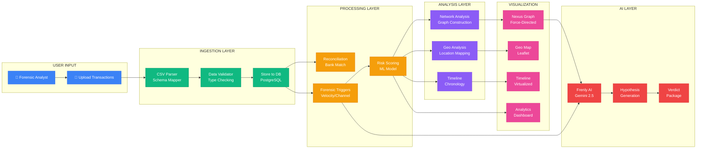
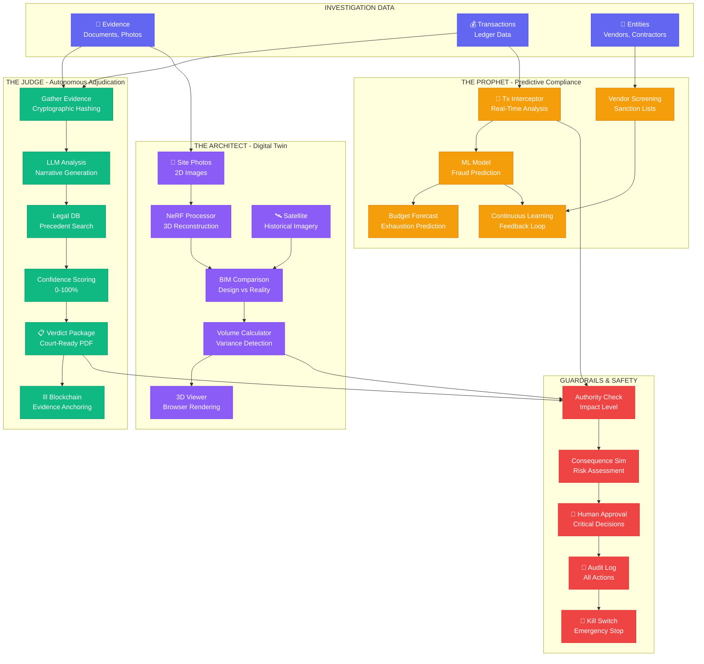
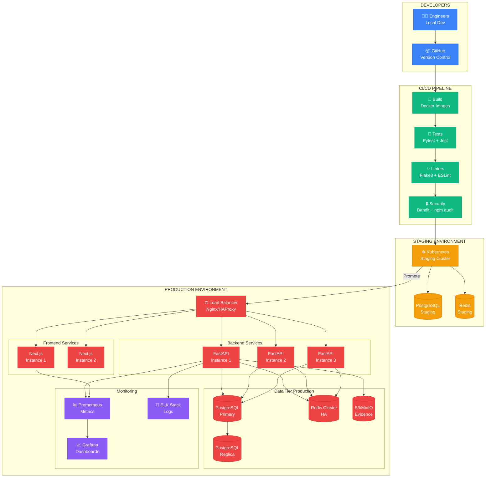
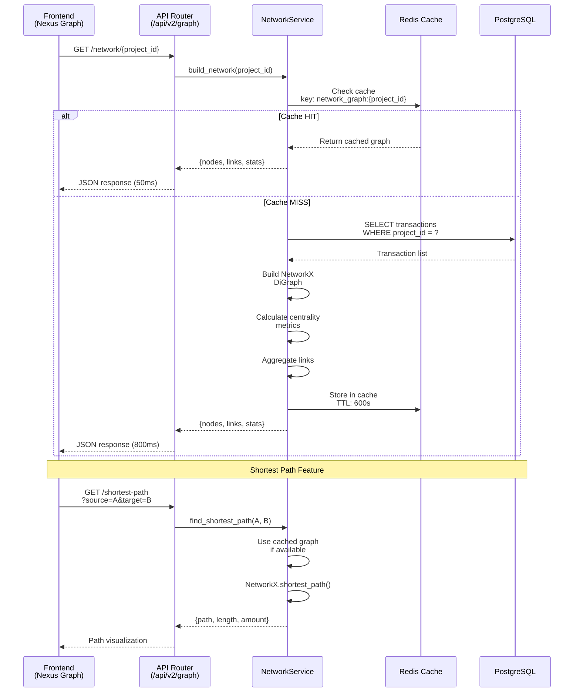
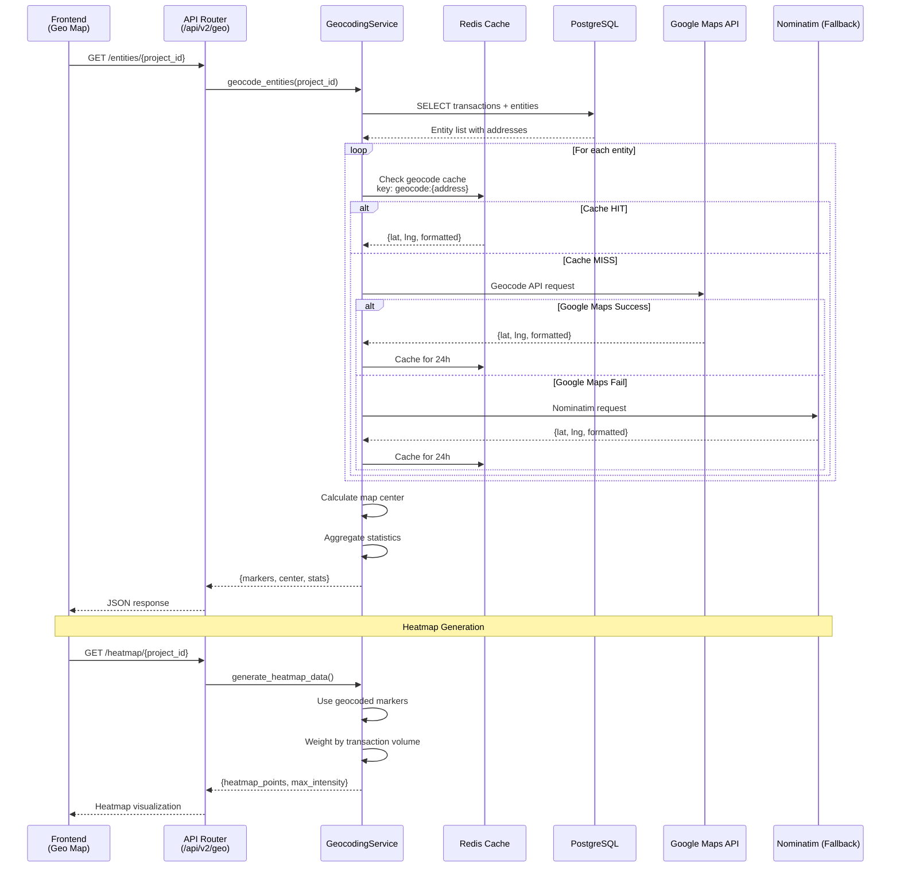
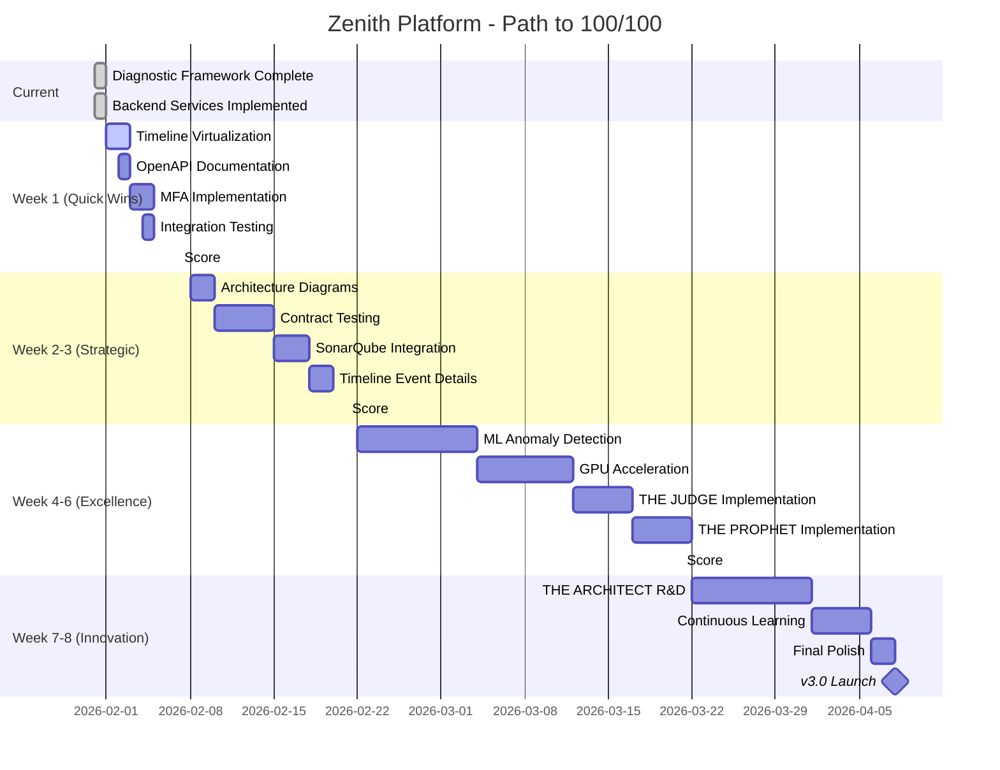

# 🎨 ZENITH PLATFORM - VISUAL ARCHITECTURE DIAGRAMS

**Purpose:** Complete visual documentation for v3.0 architecture  
**Format:** Mermaid diagrams (render in GitHub, Notion, or mermaid.live)  
**Date:** 2026-01-31

---

## 📊 1. SYSTEM ARCHITECTURE - 7-LAYER OVERVIEW

```mermaid
graph TB
    subgraph "LAYER 7: Testing & Quality Assurance"
        TEST[Integration Tests<br/>Contract Tests<br/>E2E Tests]
        CI[CI/CD Pipeline<br/>GitHub Actions]
    end
    
    subgraph "LAYER 6: Frontend Application"
        NEXT[Next.js<br/>React 18<br/>TypeScript]
        COMPONENTS[Forensic Components<br/>VirtualizedTimeline<br/>NexusGraph]
        UI[UI Library<br/>Tailwind CSS]
    end
    
    subgraph "LAYER 5: Data Processing"
        ING[Ingestion Service<br/>CSV/PDF/Images]
        REC[Reconciliation Engine<br/>Fuzzy Matching]
        RAB[RAB Analysis<br/>Material Synthesis]
    end
    
    subgraph "LAYER 4: Forensic Analysis"
        FRENLY[Frenly AI Orchestrator<br/>Gemini 2.5 Flash]
        VISION[Vision Service<br/>Photo Analysis]
        NETWORK[Network Service<br/>NetworkX]
        GEO[Geocoding Service<br/>Maps API]
    end
    
    subgraph "LAYER 3: AI & Intelligence"
        SQL[SQL Generator<br/>Text-to-SQL]
        REASON[Reasoning Engine<br/>Hypothesis Gen]
        JUDGE[THE JUDGE<br/>Auto-Prosecution]
        PROPHET[THE PROPHET<br/>Prediction]
    end
    
    subgraph "LAYER 2: Authentication & Authorization"
        AUTH[Auth Service<br/>JWT + bcrypt]
        RBAC[RBAC System<br/>UserProjectAccess]
        MFA[MFA Service<br/>TOTP]
    end
    
    subgraph "LAYER 1: Infrastructure & Deployment"
        POSTGRES[(PostgreSQL<br/>SQLModel)]
        REDIS[(Redis<br/>Cache + Sessions)]
        S3[(S3/MinIO<br/>Evidence Storage)]
        DOCKER[Docker<br/>Kubernetes]
    end
    
    %% Connections
    NEXT --> COMPONENTS
    COMPONENTS --> FRENLY
    COMPONENTS --> NETWORK
    COMPONENTS --> GEO
    
    FRENLY --> SQL
    FRENLY --> REASON
    FRENLY --> JUDGE
    FRENLY --> PROPHET
    
    NETWORK --> POSTGRES
    GEO --> POSTGRES
    RAB --> POSTGRES
    REC --> POSTGRES
    
    AUTH --> POSTGRES
    AUTH --> REDIS
    RBAC --> POSTGRES
    
    TEST --> CI
    CI --> DOCKER
    
    classDef layer1 fill:#1e40af,stroke:#1e3a8a,color:#fff
    classDef layer2 fill:#059669,stroke:#047857,color:#fff
    classDef layer3 fill:#dc2626,stroke:#b91c1c,color:#fff
    classDef layer4 fill:#7c3aed,stroke:#6d28d9,color:#fff
    classDef layer5 fill:#ea580c,stroke:#c2410c,color:#fff
    classDef layer6 fill:#0891b2,stroke:#0e7490,color:#fff
    classDef layer7 fill:#4b5563,stroke:#374151,color:#fff
    
    class POSTGRES,REDIS,S3,DOCKER layer1
    class AUTH,RBAC,MFA layer2
    class SQL,REASON,JUDGE,PROPHET layer3
    class FRENLY,VISION,NETWORK,GEO layer4
    class ING,REC,RAB layer5
    class NEXT,COMPONENTS,UI layer6
    class TEST,CI layer7
```



---

## 🔄 2. DATA FLOW DIAGRAM - TRANSACTION ANALYSIS



---

## 🤖 3. V3.0 AUTONOMOUS SYSTEMS ARCHITECTURE



---

## 🔌 4. API INTEGRATION MAP

```mermaid
graph LR
    subgraph "FRONTEND"
        NEXUS_PAGE[Nexus Graph Page]
        MAP_PAGE[Geo Map Page]
        TIMELINE_PAGE[Timeline Page]
        ANALYTICS_PAGE[Analytics Page]
    end
    
    subgraph "API LAYER"
        GRAPH_API[/api/v2/graph<br/>Network Endpoints]
        GEO_API[/api/v2/geo<br/>Geocoding Endpoints]
        ANALYTICS_API[/api/v2/analytics<br/>Aggregation Endpoints]
        SQL_API[/api/v2/sql<br/>Query Generation]
    end
    
    subgraph "SERVICE LAYER"
        NETWORK_SVC[NetworkService<br/>NetworkX]
        GEO_SVC[GeocodingService<br/>Maps API]
        ANALYTICS_SVC[AnalyticsService<br/>Aggregation]
        SQL_SVC[SQLGenerator<br/>Gemini]
    end
    
    subgraph "DATA LAYER"
        DB[(PostgreSQL)]
        CACHE[(Redis Cache)]
        EXTERNAL[External APIs<br/>Google Maps<br/>Nominatim]
    end
    
    %% Frontend to API
    NEXUS_PAGE -->|GET /network/{id}| GRAPH_API
    NEXUS_PAGE -->|GET /shortest-path| GRAPH_API
    NEXUS_PAGE -->|GET /communities| GRAPH_API
    
    MAP_PAGE -->|GET /entities/{id}| GEO_API
    MAP_PAGE -->|GET /heatmap| GEO_API
    MAP_PAGE -->|GET /cluster| GEO_API
    
    TIMELINE_PAGE -->|Query Events| SQL_API
    ANALYTICS_PAGE -->|Query Metrics| ANALYTICS_API
    
    %% API to Service
    GRAPH_API --> NETWORK_SVC
    GEO_API --> GEO_SVC
    ANALYTICS_API --> ANALYTICS_SVC
    SQL_API --> SQL_SVC
    
    %% Service to Data
    NETWORK_SVC --> DB
    NETWORK_SVC --> CACHE
    
    GEO_SVC --> DB
    GEO_SVC --> CACHE
    GEO_SVC --> EXTERNAL
    
    ANALYTICS_SVC --> DB
    SQL_SVC --> CACHE
    
    classDef frontend fill:#3b82f6,stroke:#2563eb,color:#fff
    classDef api fill:#10b981,stroke:#059669,color:#fff
    classDef service fill:#f59e0b,stroke:#d97706,color:#fff
    classDef data fill:#8b5cf6,stroke:#7c3aed,color:#fff
    
    class NEXUS_PAGE,MAP_PAGE,TIMELINE_PAGE,ANALYTICS_PAGE frontend
    class GRAPH_API,GEO_API,ANALYTICS_API,SQL_API api
    class NETWORK_SVC,GEO_SVC,ANALYTICS_SVC,SQL_SVC service
    class DB,CACHE,EXTERNAL data
```

---

## 🚀 5. DEPLOYMENT ARCHITECTURE



---

## 🔄 6. NETWORK SERVICE WORKFLOW



---

## 📍 7. GEOCODING SERVICE WORKFLOW



---

## 🎯 8. SCORING PROGRESS TIMELINE



---

## 📊 HOW TO USE THESE DIAGRAMS

### Rendering Options

1. **GitHub/GitLab:** Diagrams render automatically in `.md` files
2. **Mermaid Live:** Copy to <https://mermaid.live> for editing
3. **Notion:** Use Mermaid block type
4. **VS Code:** Install "Markdown Preview Mermaid Support" extension
5. **Draw.io:** Import Mermaid syntax

### Export Options

1. **PNG/SVG:** Use mermaid.live export function
2. **PDF:** Print from browser with diagrams rendered
3. **Presentation:** Include in slides (reveal.js supports Mermaid)

---

## 🎯 DIAGRAM SUMMARY

| **Diagram** | **Purpose** | **Audience** |
|-------------|-------------|--------------|
| 1. System Architecture | High-level 7-layer view | Executives, Architects |
| 2. Data Flow | Transaction processing flow | Engineers, Analysts |
| 3. v3.0 Autonomous | Agent system design | Product, Engineering |
| 4. API Integration | Frontend-backend mapping | Frontend Engineers |
| 5. Deployment | Production infrastructure | DevOps, SRE |
| 6. Network Service | Graph construction workflow | Backend Engineers |
| 7. Geocoding Service | Geocoding workflow | Backend Engineers |
| 8. Scoring Timeline | Progress Gantt chart | Project Managers |

---

**Created:** 2026-01-31 05:29 JST  
**Format:** Mermaid (Markdown)  
**Total Diagrams:** 8  
**Maintenance:** Update as architecture evolves

---

*"A picture is worth a thousand words. A diagram is worth a thousand lines of code."*

**🎨 Visual documentation complete!**
